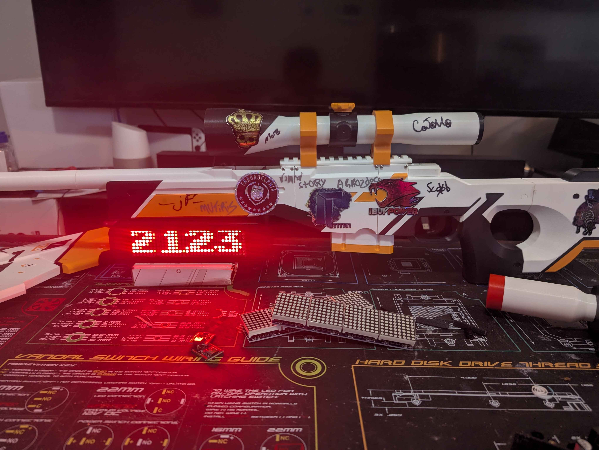

# FACEIT Dot Matrix Display


A statrak display that fetches player stats with the FaceIT and Leetify API

For now, the code only supports FaceIT ELO, but it will be expanded to additional stats such as Win/Loss, CS2 Premiere rank, league placement, and more.

## TODO

- Fix Font Scaling (Alternatively, look into different displays)
- Store local variables in SQLite
- Display Extended FaceIT stats
- Leetify API
- Twitch API
- Edit case .stl to fit under 3D Printed AWP Asiimov

## Flashing ESP32
### Prereqs:
1) Install pipx
  `sudo apt install -y pipx`
2) Install ESPHome
`pipx install esphome`
### Flashing:
1) In the repo directory, use the command:
`esphome run esp32.yaml`

## FACEIT API Documentation
- https://docs.faceit.com/api/data/

## Leetify API Documentation
- https://leetify.com/blog/leetify-api-developer-guidelines/
## Requirements

- Pipx
- ESP-Home
- Go
- A FACEIT API key

## Setup
1) Edit the `.env.example` file in the project root:
```
FACEIT_API_KEY=your_key_here
FACEIT_GAME=cs2
```
Then rename to `.env`

2) Install Dependencies:
```
go get github.com/joho/godotenv@latest
go mod tidy
```
4) Run:
`go run .`

## References:
1) https://www.xda-developers.com/built-15-esp32-smart-clock/
2) https://mholt.github.io/json-to-go/
